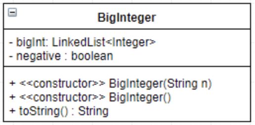
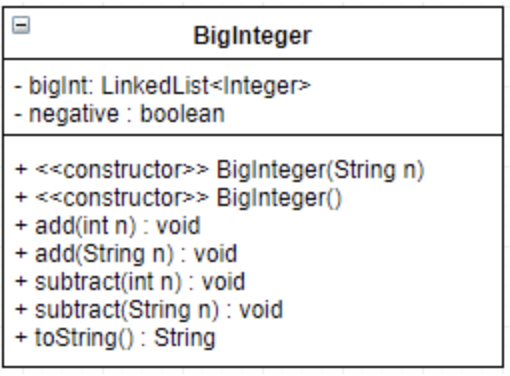

# CS113-GP1-BigInteger
## GP #1 for CS113 - BigInteger ADT implementation + driver (using Agile Development/Scrum)

>Java’s signed long datatype maxes out at 2^63^ - 1, but currently, the largest known prime number is 2^77,232,917^ - 1. Mathematicians who search for prime numbers need to be able to hold gigantic numbers of any size. As well, they need to be able to iterate through values by adding (a rudimentary example would be the Sieve of Eratosthenes, a simple, ancient algorithm for finding all prime numbers up to any given limit). Your group’s job is to create an abstract data type (ADT) which will hold any size integer, your implementation should allow the creation of the BigInteger from a String, as well as adding/subtracting from int and String type data. You will use a LinkedList and iterator, since using an array would have over twenty three million digits and increasing the array’s size would be a costly and unneeded operation.

The following problem will be done in groups of two using Agile Development (Scrum).  For this first group project, Sprint 0 has been done for you as a sample of what you expect for future group projects, as well as the details of Sprint 1 and 2.  ***Your group need only write the code for Sprint 1 and Sprint 2, fitting the definition of done.***  Remember that at the end of each sprint you should have a working produce to showcase (each week there will be a check-in during class time).

## Sprint 0 (Planning sprint)
[x] Gather requirements
[x] Breakdown into two logical/doable sprints (Sprint 1 and Sprint 2)
[x] Formally define **each** sprint with the following (*see Topic 1 for more details*):
- [x] User Story (1-2 sentences in everyday language of end user that summarizes what needs to be developed)
- [x] Detailed description of what you are accomplishing/doing
- [x] Create list of tasks and tests using Agile task board (we'll use Trello)
- [x] Definition of done (the following applies for each sprint):
	- Code adheres to coding standard/convention
	- Code is documented
	- Code checked into GitHub
	- Unit tests were written, all pass
	- Relevant diagrams and documentation updated and accurate (UML class/sequence diagrams, etc.)

[x] Think, dialogue with partner, and make some big technical decisions (decide on data structure(s) that is/are the most reasonable for implementation, classes to create, methods for each, diagrams, etc.)

## Sprint 1 (BigInteger foundation)
**User Story**:
>As a ***user*** I want to ***be able to be able to represent numbers of any size, negative or positive,*** so that ***I can display them to the user***.

**Documentation Diagrams**:

[ ***insert example of drawing here*** ]

**Definition Of Done**:
- [  ] General requirements 
- [  ] Draw an example of how a large integer will be stored within the LinkedList (add image to this README.md in space provided above)
- [  ] Passes all JUnit tests for this sprint
- [  ] Complete following statement in space below:
>Our strategy for implementing addition/subtraction for Sprint 2 is [ ***type your approach here in 2-3 sentences*** ].
- [  ] Product owner agrees (received from instructor)

## Sprint 2 (BigInteger arithmetic + driver)
## Sprint 1 (BigInteger foundation)
**User Story**:
>As a ***user*** I want to ***be able to be able to add and subtract numbers of any size, negative or positive,*** so that ***I can do arithmetic operations on huge numbers***.

**Documentation Diagrams**:

**Definition Of Done**:
- [  ] General requirements 
- [  ] Passes all JUnit tests for this sprint
- [  ] Implement driver which solves [Problem 13](https://projecteuler.net/problem=13) from Project Euler to showcase Sprint 2
- [  ] Product owner agrees (received from instructor)

----------
### Make sure to commit + push *before* the deadline to have your code be considered for grading.
>Pro-Tips:
>- Signup for [Trello](https://trello.com)
>- Go through the [Trello 101](https://trello.com/guide/trello-101) quick overview page (you don't need to go through the full tutorial just yet, the first page is enough)
>- Join our [Trello Team](https://trello.com/invite/cs113spring2018/c84867339427cfcd01e7e74a13191bd4)
>- Once you're added to the Trello Team, you can copy boards by:
>	- Going to the Trello team page (CS113 - Spring 2018)
>	- Clicking on the board for a sprint (BigInteger-Sprint1)
